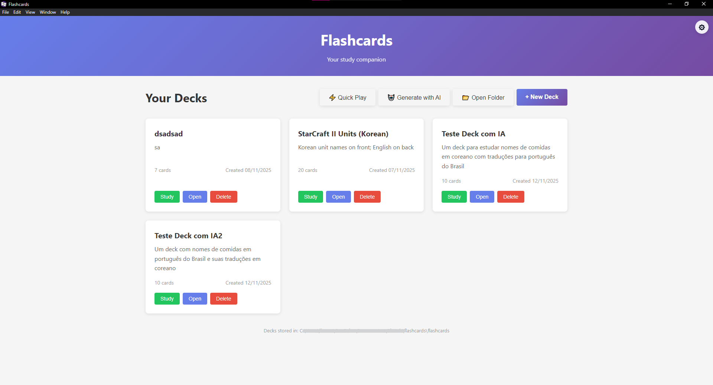
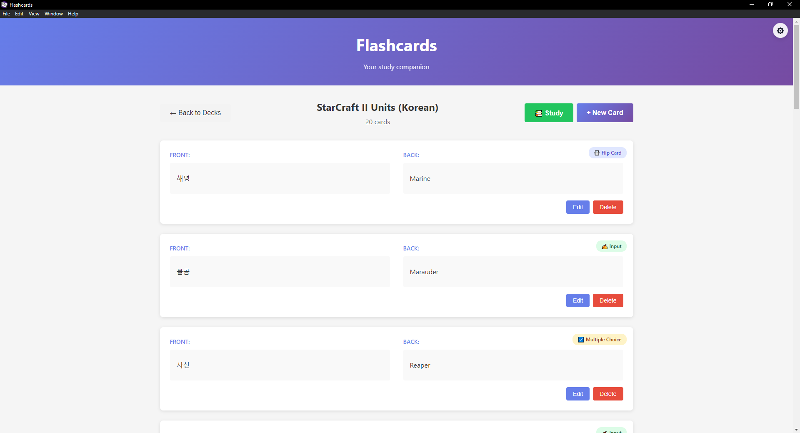
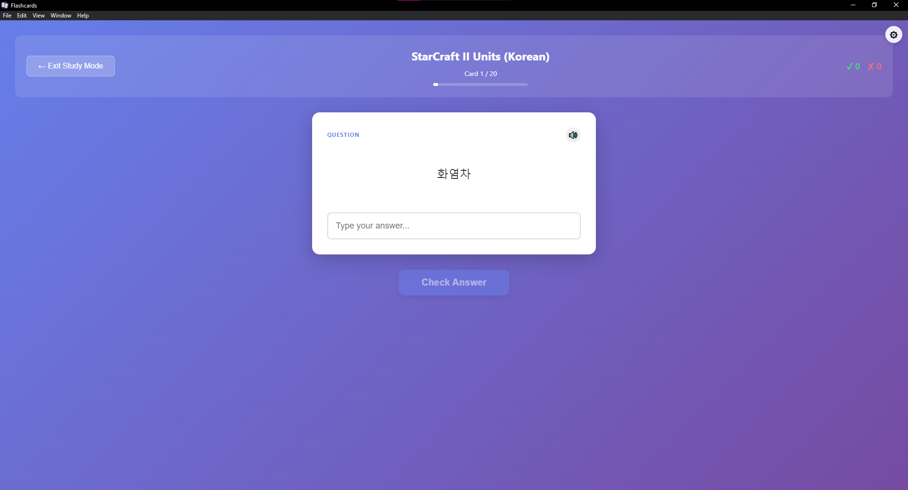
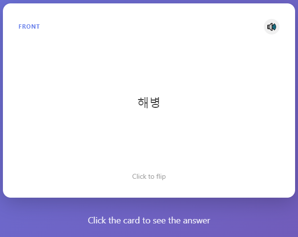
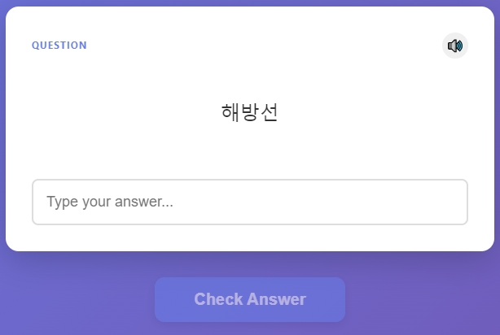
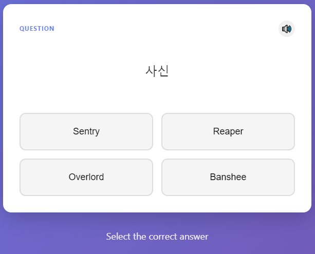
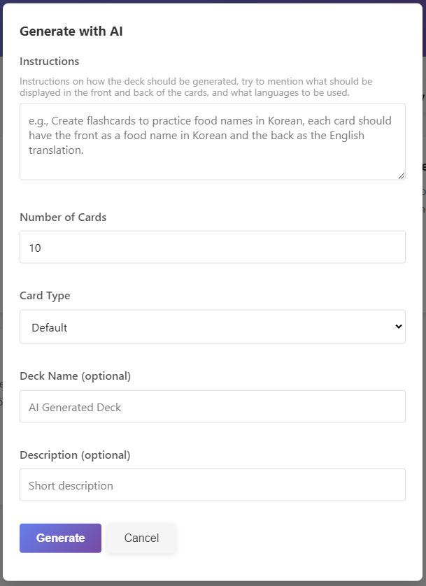

# Flashcards

Electron + Vue desktop app to create, manage, and study flashcards. Supports AI-generated decks, multiple card types, text-to-speech, and a Quick Play mode for instant practice.

## Features

**Deck and Cards management**
- Create, list, open, and delete decks and cards
- Decks are stored as folders and cards as markdown files
- Deck metadata tracked in `deck.json` (name, description, card count, timestamps, tags)
- Support for images (stored under `assets/` in each deck) to be shown on the card's face
- Cards can currently be one of three types:
  - `default` (basic flip cards with front and back)
  - `input` (a question and an expected input answer)
  - `multiple-choice` (add fake answers to create a 4-alternatives quiz)

**Study mode**
- Progress indicator, remembered/forgot counters, accuracy
- Text-to-speech with language auto-detection
- Works across all card types

**Quick Play**
- Start a study session instantly (not saved to disk)
- Select number of cards and card type (`default` or `input`)
- Currently available Subjects:
  - Sino‑Korean numbers (both directions)

**Generate Deck with AI**
- Create a full deck from given instructions
- Choose number of cards, deck name/description, and card type
- Powered by DeepSeek via OpenAI client; API key should be provided and is stored locally in app settings

**Settings**
- Manage secrets like `DEEPSEEK_API_KEY`
- Persisted to the app’s user data directory

## How it works

### Architecture (high level)
**Frontend (Vue 3 + Vite)**: UI components under `src/` render decks, cards, study flows, and modals.
**Electron main process** (`electron/`): creates the window, wires IPC handlers, and serves the Vue app (dev via Vite, prod via `dist/`).
**Preload + IPC**: Safe, typed bridges exposed on `window`:
- `window.deckAPI`: list/create/get/update/delete, open decks directory
- `window.cardAPI`: list/get/create/update/delete cards, update from markdown, get image data
- `window.settingsAPI`: get/set app settings
- `window.aiAPI`: generate a deck from AI

### Storage
- In development: decks live in the repository’s `flashcards/` directory.
- In production: decks live in the OS user data dir, typically:
  - Windows: `%AppData%/Flashcards` (via Electron `app.getPath('userData')`)

### Deck layout on disk
Each deck is a folder with a `deck.json`, markdown cards, and an `assets/` folder for images.

```
flashcards/
└── my-deck/
    ├── deck.json
    ├── 001.md
    ├── 002.md
    └── assets/
        └── image.png
```

`deck.json` example (fields may grow over time):

```json
{
  "id": "001",
  "name": "Food Names in Korean",
  "description": "A deck of food names in Korean",
  "created": "2025-01-01T00:00:00.000Z",
  "modified": "2025-01-01T00:00:00.000Z",
  "cardCount": 12,
  "tags": ["korean", "vocabulary"]
}
```

### Card file format
Cards are simple markdown with optional metadata (front‑matter‑like block) and two sections: `# Front` and `# Back`. Images can be placed in the front section and are copied to `assets/` when added.

```md
---
id: 001
created: 2025-01-01T00:00:00.000Z
tags: ["korean", "food"]
difficulty: medium
type: input
options: ["noodle", "rice", "fruit"]  # only for multiple-choice
---

# Front
국수

# Back
Noodles


```

- `type`: one of `default`, `input`, `multiple-choice`
- `options`: only for `multiple-choice` cards

### AI deck generation
- Configure `DEEPSEEK_API_KEY` in Settings (top‑right in the app)
- Choose instructions, number of cards (up to 50), optional deck name/description, and card type
- The app requests a strict JSON deck from DeepSeek and saves it as a new deck

### Quick Play generation
Implemented via strategies under `src/services/deckBuilders/`. Currently the only available subject is Sino‑Korean numbers:
- `numbers-to-sino-korean`
- `sino-korean-to-numbers`

These sessions focus on creating randomized study cards, perfect for studying things like numbers, math, and anything that can be easily randomly generated.

> Generated sessions are ephemeral and not written to disk.

## Screenshots (placeholders)
Add screenshots under `docs/screenshots/` and update these paths.

#### Deck list

#### Showing a deck of cards

#### Study mode

#### Default flip card

#### Input card

#### Multiple choice card

#### Generate Deck with AI


## Getting started (short)

Prereqs: Node.js 18+

```bash
# install
npm install    # or: yarn install

# run (dev)
npm run dev    # or: yarn dev

# build (installer)
npm run build  # or: yarn build
```

Notes:
- Dev serves Vite on `http://localhost:5173` and opens Electron with HMR.
- Prod builds and packages the Electron app with `electron-builder`.

## Tech stack
- Electron 28
- Vue 3
- Vite 5
- Marked (markdown rendering)
- OpenAI client (DeepSeek API)

## Features for the future
- A fresh look to shave off this AI look
- Spaced repetition scheduling (e.g., SM‑2) with per‑card intervals
- Persist study history; per‑deck stats dashboard; resume sessions
- Keyboard shortcuts for study and card actions
- Import/export decks (e.g., zip `deck.json` + markdown + assets)
- Cloud storage for decks via optional login and a deck-sharing hub
- Deck rename, tags, search and filtering
- More subjects and builders for Quick Play
- AI multiple‑choice generation with distractors
- Configurable decks directory location in Settings
- Optional i18n of the UI; voice selection for TTS

## License
MIT
